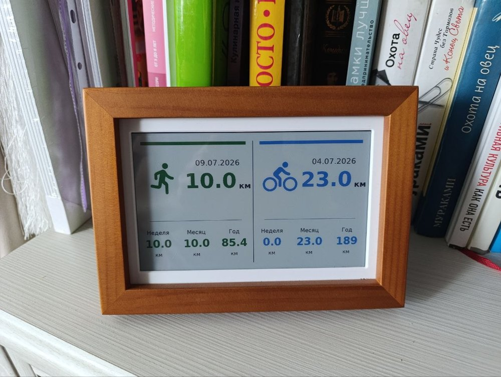
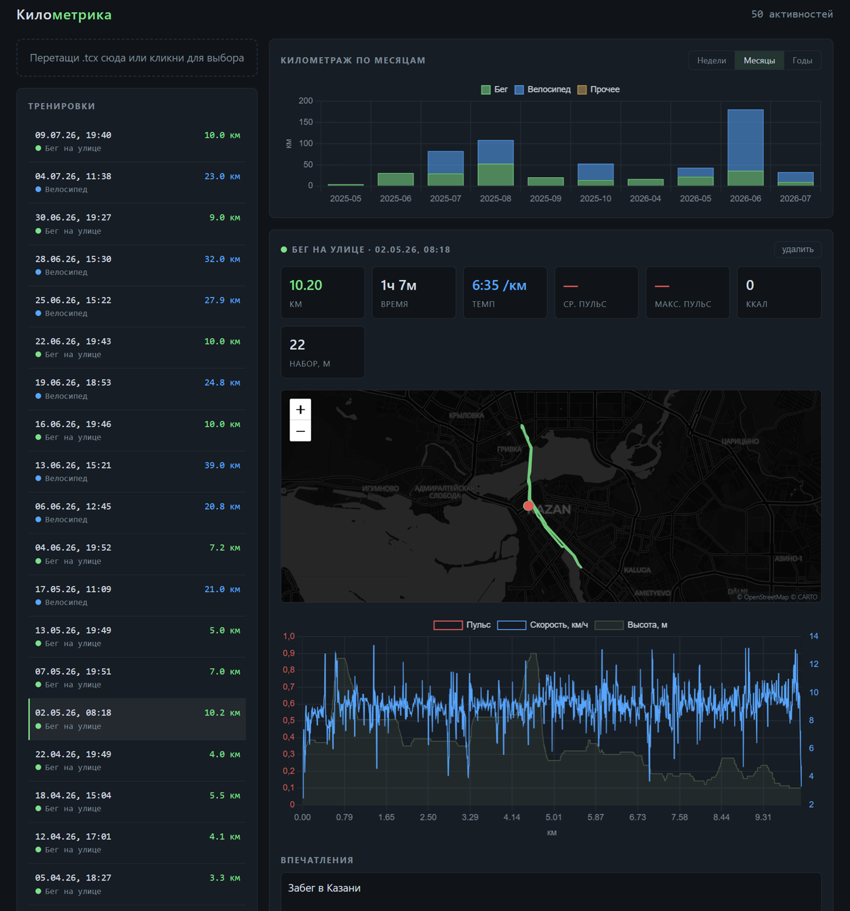

# Kilometrika




**Kilometrika** (from the Russian «километр» + metrics) is a small self-hosted training log: it collects workout files in TCX and GPX formats and turns them into a dashboard — and into a stats card for an e-ink photo frame on your shelf. Drop files in, get a dashboard: per-activity heart rate / speed / elevation charts, a GPS track on a map, and distance totals by week, month, or year — split by sport.

Built for a homelab: single container or a plain systemd service, SQLite storage, no cloud, no accounts. Your GPS tracks stay on your hardware.

*Русская версия: [README.ru.md](README.ru.md)*

## The dashboard



Activity list color-coded by sport, stacked weekly/monthly/yearly distance chart, and a per-activity view: summary cards, GPS track on a dark map, aligned HR / speed / elevation chart, notes, and photo attachments.

## Features

- **Two ingestion paths** — drag & drop in the web UI, or a watch folder you can expose over SMB/FTP and feed from a phone or NAS. Deduplication by content hash (SHA-256).
- **Robust parsing** — powered by [tcxreader](https://github.com/alenrajsp/tcxreader); handles Garmin, Polar, Suunto, Zwift and friends, including TPX extensions (Speed, Watts).
- **Degraded exports welcome** — some apps (e.g. Huawei Health / Mi Fitness) export TCX with GPS only: no per-point distance, speed, heart rate or calories. The parser reconstructs cumulative distance and speed from coordinates (haversine, with GPS-jitter filtering), so charts and pace still work. Heart rate can't be invented — see [Getting full data out of Huawei Health](#getting-full-data-out-of-huawei-health).
- **Dashboard** — activity list color-coded by sport (running / cycling / other), stacked distance chart with a week / month / year toggle, and a per-activity view: summary cards, GPS track on a dark Leaflet map with start/finish markers, and an aligned HR / speed / elevation chart over distance.
- **Training diary** — free-form notes ("how did it go"), photo and video attachments on every activity, stored next to the database. Uploads are streamed to disk (500 MB per video), playback supports seeking via range requests.
- **REST API** — everything the UI shows is available as JSON, convenient for pandas / Jupyter deep dives.
- **Optional Home Assistant bridge** — the service publishes a retained MQTT message with per-sport (run / bike) weekly, monthly and yearly totals after each import and hourly; ready-made sensor config below.
- **E-ink photo frame endpoint** — `GET /api/frame.png` renders a 800×480 landscape stats card in the Spectra 6 palette: running and cycling halves with sport pictograms, the latest workout of each, and calendar week / month / year totals. ETag / `304 Not Modified` support means the frame only redraws when something actually changed. Point [esp32-photoframe](https://github.com/aitjcize/esp32-photoframe)'s URL rotation at it.
- **Crash-proof watcher** — parse errors go to a `failed/` folder, permission problems on the watch folder are logged and skipped instead of killing the loop.

## Quick start (Docker)

```bash
docker compose up -d --build
# UI: http://<host>:8000
```

Data lives in `./data`:

```
data/
├── tcx.db      # SQLite: activities + trackpoints
├── inbox/      # drop .tcx / .gpx files here — picked up automatically
├── archive/    # successfully imported
└── failed/     # files that failed to parse
```

The inbox is polled every `WATCH_INTERVAL` seconds (default 30). To feed it from a NAS or router share, bind-mount the share over the inbox:

```yaml
volumes:
  - ./data:/data
  - /mnt/my-share:/data/inbox
```

## Quick start (bare metal / LXC, no Docker)

Runs fine as a plain systemd service — handy in a Proxmox LXC where Docker-in-LXC is more trouble than it's worth.

```bash
apt install -y python3-venv
useradd -r -m -d /opt/tcx-analyzer -s /usr/sbin/nologin tcx
# copy the repo into /opt/tcx-analyzer, then:
cd /opt/tcx-analyzer
python3 -m venv venv && ./venv/bin/pip install -r requirements.txt
chown -R tcx:tcx /opt/tcx-analyzer
```

`/etc/systemd/system/tcx-analyzer.service`:

```ini
[Unit]
Description=TCX Analyzer
After=network-online.target
Wants=network-online.target

[Service]
Type=simple
User=tcx
Group=tcx
WorkingDirectory=/opt/tcx-analyzer/app
Environment=DATA_DIR=/opt/tcx-analyzer/data
ExecStart=/opt/tcx-analyzer/venv/bin/uvicorn main:app --host 0.0.0.0 --port 8000
Restart=on-failure
RestartSec=5
NoNewPrivileges=true
ProtectSystem=strict
ReadWritePaths=/opt/tcx-analyzer/data
PrivateTmp=true

[Install]
WantedBy=multi-user.target
```

```bash
systemctl daemon-reload && systemctl enable --now tcx-analyzer
```

Set the host timezone so dashboard and frame dates are shown local, not UTC: `timedatectl set-timezone Europe/Moscow` (or pass `TZ=` in the unit / docker-compose).

If the watch folder is a CIFS/NFS mount, make sure the `tcx` user can **write** to it — the watcher moves files out of the inbox after import. In an unprivileged LXC, remember the uid shift: mount with `uid=<uid of tcx inside> + 100000`.

## Configuration

Everything is environment variables:

| Variable | Default | Purpose |
|---|---|---|
| `DATA_DIR` | `/data` | database + inbox/archive/failed root |
| `WATCH_INTERVAL` | `30` | inbox poll period, seconds |
| `MQTT_HOST` | *(empty = off)* | MQTT broker for the Home Assistant bridge |
| `MQTT_PORT` | `1883` | |
| `MQTT_USER` / `MQTT_PASS` | *(empty)* | |
| `MQTT_PREFIX` | `tcx_analyzer` | topic prefix |
| `FRAME_LANG` | `ru` | e-ink card language: `ru` or `en` |

## API

```
POST   /api/upload                              upload a .tcx / .gpx file
GET    /api/activities                          list all activities
GET    /api/activities/{id}                     details + laps + notes + photos
GET    /api/activities/{id}/trackpoints?step=N  point series (step=N thins it)
PATCH  /api/activities/{id}/notes               save workout notes
POST   /api/activities/{id}/photos              attach a photo
GET    /api/photos/{photo_id}                   serve a photo
DELETE /api/photos/{photo_id}
DELETE /api/activities/{id}
GET    /api/summary/weekly?weeks=12             weekly totals
GET    /api/frame.png                           e-ink stats card (ETag / 304)
```

## The e-ink frame

The photo above is a 7.3" Waveshare Spectra 6 (E6) e-ink photo frame ([available on AliExpress](https://aliexpress.ru/item/1005010466222338.html)) running the open-source [esp32-photoframe](https://github.com/aitjcize/esp32-photoframe) firmware. Point its *Auto-Rotate URL* at `http://<kilometrika-host>:8000/api/frame.png` and it redraws itself whenever a new workout is imported — the endpoint serves an ETag, so the frame skips refresh cycles (and saves battery) when nothing changed. Calendar counters reset on Mondays and on the 1st automatically.

Card labels are in Russian by default; set `FRAME_LANG=en` to render them in English (Week / Month / Year, km).

## Home Assistant integration

Set the `MQTT_*` variables; the service publishes a retained message to `tcx_analyzer/state` after every import **and hourly** (so calendar counters reset on Mondays and the 1st even without new workouts):

```json
{
  "run":  {"last_date": "2026-07-09 19:40", "last_km": 10.0, "last_hr_avg": null,
           "week_km": 10.0, "month_km": 29.7, "year_km": 129.7},
  "bike": {"last_date": "2026-07-04 08:38", "last_km": 23.0, "last_hr_avg": null,
           "week_km": 0.0, "month_km": 55.5, "year_km": 538.0},
  "total_activities": 42,
  "updated": "2026-07-11T09:00:00+03:00"
}
```

Categories and calendar boundaries (local timezone, ISO weeks) match the e-ink frame card. Sensors:

```yaml
mqtt:
  sensor:
    - name: "Run week distance"
      state_topic: "tcx_analyzer/state"
      value_template: "{{ value_json.run.week_km }}"
      unit_of_measurement: "km"
    - name: "Bike week distance"
      state_topic: "tcx_analyzer/state"
      value_template: "{{ value_json.bike.week_km }}"
      unit_of_measurement: "km"
    - name: "Last run"
      state_topic: "tcx_analyzer/state"
      value_template: "{{ value_json.run.last_km }}"
      unit_of_measurement: "km"
```

Ready-made configs live in `ha/`: `mqtt_sensors.yaml` (11 sensors grouped as a Kilometrika device) and `dashboard.yaml` (a sections-layout view: run and bike tiles, the e-ink card image, a 30-day history graph). Entity ids in `dashboard.yaml` are derived from the Russian sensor names — adjust if you rename them.

## Getting full data out of Huawei Health

Huawei Health's per-workout TCX export contains GPS and altitude only. Two ways to get heart rate:

1. **Ongoing:** the Health Sync app can push workouts (with HR) from Huawei Health to Strava; Strava's TCX export is complete. 
2. **Full history:** request your data at Huawei's privacy portal; the resulting archive contains per-second HR JSON that [huawei-tcx-converter](https://github.com/aricooperdavis/Huawei-TCX-Converter) turns into proper TCX files — drop the batch into the inbox.

## Development

```bash
pip install -r requirements.txt -r requirements-dev.txt
pytest tests/
```

The suite covers the parsers (full Garmin-style TCX, degraded Huawei-style TCX with the haversine fallback, Strava-style GPX with HR/cadence extensions), storage with schema migration of older databases, and the API including upload dedup, notes, photos and the frame ETag.

## Notes

- Chart.js and Leaflet are vendored under `app/static/vendor/` — the dashboard works with no internet access at all, except the map basemap, which is fetched from a public tile CDN (CARTO / OpenStreetMap); the track itself never leaves your server. For a fully offline setup, point the tile URL in `app/static/index.html` at your own TileServer GL instance.
- SQLite comfortably handles thousands of activities. The `trackpoints` table maps 1:1 onto a TimescaleDB/Grafana setup if you outgrow the built-in charts.
- Calories are stored when present but treated as informational — every vendor estimates them differently.
- Sport pictograms on the frame card are official [Material Icons](https://github.com/google/material-design-icons) (`directions_run`, `directions_bike`), Apache License 2.0.
